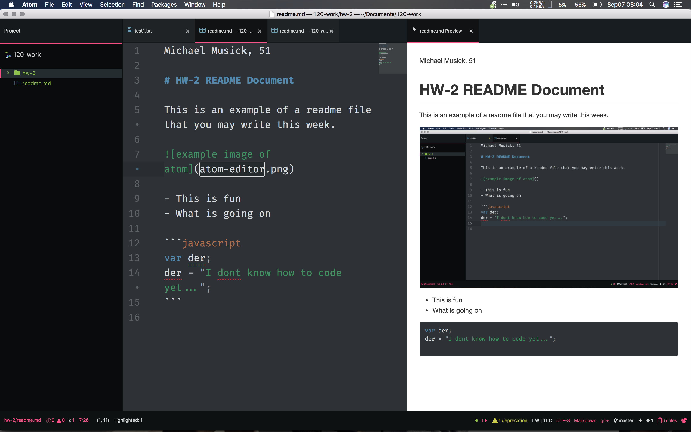

Michael Musick, 51

# HW-2 README Document

This is an example of a readme file that you may write this week.



- This is fun
- What is going on

```javascript
var der;
der = "I dont know how to code yet...";
```
